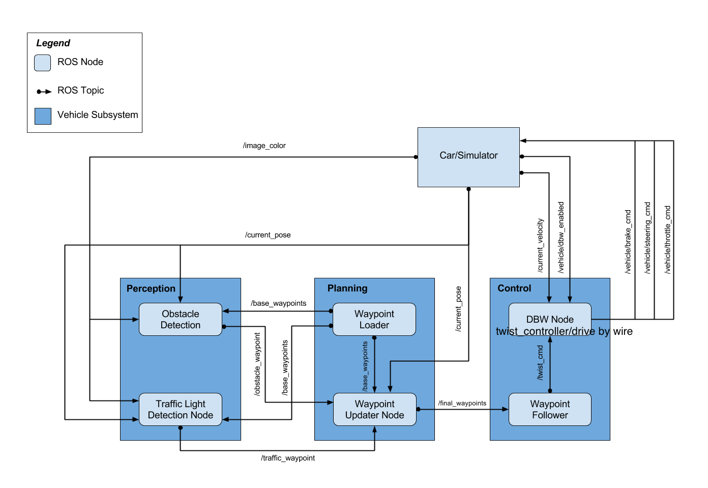

This is the final project of the Udacity Self-Driving Car Nanodegree: Programming a Real Self-Driving Car.

## Repo overview

This project is run in ROS. The predefined ROS architecture is shown below.

The code is first written in this repo and then copied to Udacity Workspace for simulation.

Following ROS packages are to be implemented by me in /ros/src/:

* tl_detector: traffic light detection node. This node takes in data from the `/image_color`, `/current_pose`, and `/base_waypoints` topics and publishes the location to stop for the next red traffic light to the `/traffic_waypoint` topic.

* waypoint_updater: waypoint updater node. This node will subscribe to the `/base_waypoints`, `/current_pose`, `/obstacle_waypoint`, and `/traffic_waypoint` topics, and publish a list of waypoints ahead of the car with target velocities to the `/final_waypoints` topic.

* twist_controller: drive-by-wire (DBW) control node. This node subscribes to the `/current_velocity` topic along with the `/twist_cmd` topic to receive target linear and angular velocities. Additionally, this node will subscribe to `/vehicle/dbw_enabled`, which indicates if the car is under dbw or driver control. This node will publish throttle, brake, and steering commands to the `/vehicle/throttle_cmd`, `/vehicle/brake_cmd`, and `/vehicle/steering_cmd` topics.

Following ROS packages are predefined in /ros/src/:

* styx: A package that contains a server for communicating with the simulator, and a bridge to translate and publish simulator messages to ROS topics.

* styx_msgs: A package which includes definitions of the custom ROS message types used in the project.

* waypoint_loader: A package which loads the static waypoint data and publishes to `/base_waypoints`.

* waypoint_follower: A package containing code from Autoware which subscribes to `/final_waypoints` and publishes target vehicle linear and angular velocities in the form of twist commands to the `/twist_cmd` topic.

---

## Message types

It is important to understand the used message types and their compostions, in order to correctly subscribe and publish parameters.

* Lane: .header + .waypoints (Waypoint)
  * waypoints: .pose (PoseStamped) + .twist (TwistStamped)
    * pose: .header + .pose
        * pose: .position(.x, .y, .z) + .orientation(.x, .y, .z, .w)
    * twist: .header + .twist
        * twist -> .linear(.x, .y, .z) + .angular(.x, .y, .z)

* Int32: .data

* TrafficLightArray: .header + .lights (TrafficLight)
  * lights -> .pose + .state (UNKNOWN=4, GREEN=2, YELLOW=1, RED=0)

---

## Implementation

#### tl_detector/tl_detector.py

The class TLDetector is defined and initialised with corresponding subscribers and publisher. The information of the stop line waypoint of each traffic light is provided in `traffic_light_config`.

In the base_waypoints callback function, the x and y coordinates are used to create a KDTree, so that later the closest waypoint to a certain coordinate pair can be found easily in the function `get_closest_waypoint`.

The image callback function uses the `get_light_state` function, which returns the traffic light status provided by the simulator. Due to lack of GPU resources, no machine learning is used to build a classifier. So this repo can only be used in the simulator, not for the Udacity car Carla.

#### waypoint_updater/waypoint_updater.py

The class WaypointUpdater is defined and initialised with corresponding subscribers and publisher. A loop is defined to publish the next 200 waypoints regularly. Here it took me a long time to find out why my code didn't work in the simulator (published waypoints were behind the car) and it was a lucky try to reduce the rate recommended by the course.

**IMPORTANT: The rate should be set to a very low value, like 5 Hz. A rate equal or close to 50 Hz will cause extreme latency in the simulator.**

A similar function to the one in tl_detector.py is used to get the closest waypoint to the car's current position.

If the car needs to stop at the next red light, a decelerate function is defined to brake the car.

#### twist_controller/twist_controller.py

* A yaw controller is used to output the steering angle.
* A PID controller is used to output the throttle value.
* A low pass filter is used to filter the noisy current velocity provided by the simulator.

#### twist_controller/dbw_node.py

This drive-by-wire node uses the twist controller to publish the throttle, brake and steering commands.
